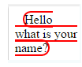
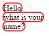
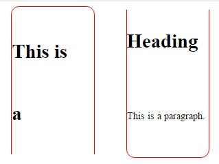

# Box-decoration-break


*CSS Property*


The CSS property box-decoration-break dictates what happens to an element boxes (padding, border, and margin) when there is a situation that the element is broken apart into various different lines. This separating of an element into different lines is called fragmentation. This is like when you take a grenade blows apart and separate its various parts to different areas. The same apply for elements, though less explosively. There are times when the parts of an element are meant to run together but then they get moved to another line or column 
Write a description here. Provide an overview of what the reference entry is, how it's used, it's significance, or how it's commonly used.


## Syntax


Introduction to the syntax/usage. A example of CSS syntax is below:


```
       box-decoration-break: slice | clone
```


### Values


slice | clone


#### Slice


The slice value is the default value for box-decoration-break. If you add it, then it will tell the browser to treat the element like a fragment. If you don't add it, the browser will do this automatically.


#### Clone


When the clone value is added to box-decoration-break, the margin, border, and padding is applied to each fragment as if it was an isolated complete element instead of a fragment. For example if the element had a border applied, in its fragmented state the border property may only be on the top or bottom of each element, and not left or right. The clone value will ensure each fragment is treated like a separate element, and have a full border


## Example 1


In this simple example, we will simulate what it looks like to have a line fo text broken up into multilines and the effect it has before and after box-decoration-break is applied:


```
<style>
.text{
border : 2px solid red;
border-radius : 13px;
margin-left: 10px;-webkit-box-decoration-break: clone;
}
</style>
<body> <span class=”text”>Hello<br>what is your<br>name?</span></body>
```
This is how the above text will display before you add box-decoration-break :clone;



After you add box-decoration-break : clone;

```
<style>
.text{
border : 2px solid red;
border-radius : 13px;
margin-left: 10px;-webkit-box-decoration-break: clone;
}
</style>
<body> <span class=”text”>Hello<br>what is your<br>name?</span></body>
```




## Example 2


In this example we will use a bit more complex situation and show the use of the clone value, when columns are added..

Let’s stay you begin with an element that looks like this : 


Css
```
.text{
border : 2px solid red;
border-radius : 13px;
margin-left: 10px;
-webkit-box-decoration-break: slice;
display : block;
Width : 30%;
}

.column{
columns : 2;
line-height : 100px;
}
```

HTML 
```
<div class="column">
<span class="text"><h1>This is <br>a Heading</h1>
<p>This is a paragraph.</p></div></span>
}
```


If you were to change the -webkit-box-decoration-break property to clone
Css
```
.text{
border : 2px solid red;
border-radius : 13px;
margin-left: 10px;
-webkit-box-decoration-break: clone;
display : block;
Width : 30%;
}

.column{
columns : 2;
line-height : 100px;
}
```

HTML 
```
<div class="column">
<span class="text"><h1>This is <br>a Heading</h1>
<p>This is a paragraph.</p></span></div>
}
```

Do to limittations about which browser fully support box-decoration-breaks, there is not graphic to show how it would look. In theory similar to example 1, a bottom and top border would be added to the two elements.

## Special Notes


This property is not yet available in all browsers. Currently it is supported by Chrome, Firefox, and Opera. This means you will have to include multiple properties with the prefix of "-webkit-" in your rule-set for it to work with different browsers.


